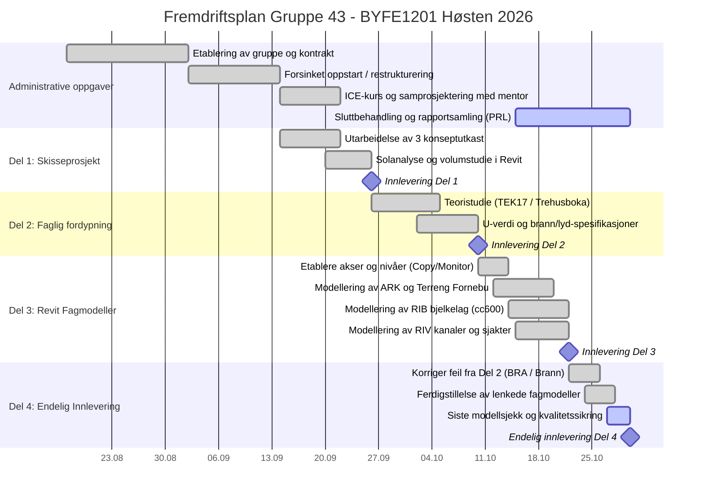

```mermaid
gantt
    title Fremdriftsplan Gruppe 43 - BYFE1201 Høsten 2026
    dateFormat  YYYY-MM-DD
    axisFormat %d.%m
    tickInterval 1w

    section Administrative oppgaver
    Etablering av gruppe og kontrakt       :done,    adm1, 2026-08-17, 2026-09-02
    Forsinket oppstart / restrukturering   :done,    adm2, 2026-09-02, 2026-09-14
    ICE-kurs og samprosjektering med mentor:done,    adm3, 2026-09-14, 2026-09-22
    Sluttbehandling og rapportsamling (PRL):active,  adm4, 2026-10-15, 2026-10-30

    section Del 1: Skisseprosjekt
    Utarbeidelse av 3 konseptutkast        :done,    d1_1, 2026-09-14, 2026-09-22
    Solanalyse og volumstudie i Revit      :done,    d1_2, 2026-09-20, 2026-09-26
    Innlevering Del 1                      :milestone, m1, 2026-09-26, 0d

    section Del 2: Faglig fordypning
    Teoristudie (TEK17 / Trehusboka)       :done,    d2_1, 2026-09-26, 2026-10-05
    U-verdi og brann/lyd-spesifikasjoner   :done,    d2_2, 2026-10-02, 2026-10-10
    Innlevering Del 2                      :milestone, m2, 2026-10-10, 0d

    section Del 3: Revit Fagmodeller
    Etablere akser og nivåer (Copy/Monitor):done,    d3_1, 2026-10-10, 2026-10-14
    Modellering av ARK og Terreng Fornebu  :done,    d3_2, 2026-10-12, 2026-10-20
    Modellering av RIB bjelkelag (cc600)   :done,    d3_3, 2026-10-14, 2026-10-22
    Modellering av RIV kanaler og sjakter  :done,    d3_4, 2026-10-15, 2026-10-22
    Innlevering Del 3                      :milestone, m3, 2026-10-22, 0d

    section Del 4: Endelig Innlevering
    Korriger feil fra Del 2 (BRA / Brann)  :done,    d4_1, 2026-10-22, 2026-10-26
    Ferdigstillelse av lenkede fagmodeller :done,    d4_2, 2026-10-24, 2026-10-28
    Siste modellsjekk og kvalitetssikring  :active,  d4_3, 2026-10-27, 2026-10-30
    Endelig innlevering Del 4              :milestone, m4, 2026-10-30, 0d
```
